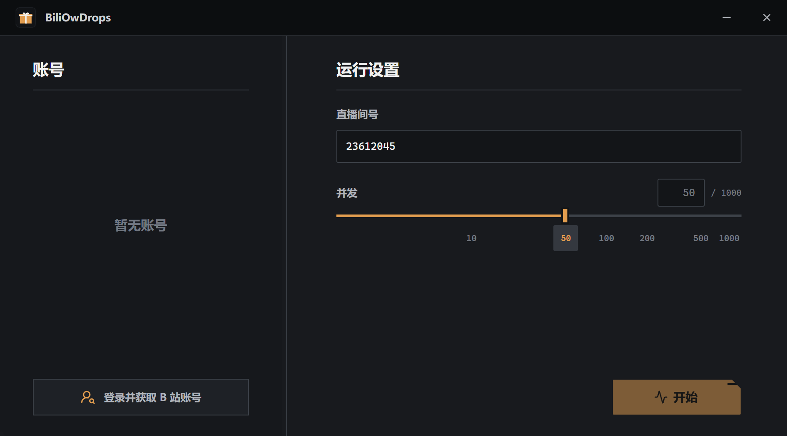

# BiliOwDrops 使用说明

BiliOwDrops 是一款用于 B 站直播 OW 掉宝活动的桌面工具。它会在应用内打开 B 站登录页面，使用你选择的账号进入指定直播间，保持观看状态并实时显示掉宝进度。

---

## 快速上手

1. 启动 `BiliOwDrops`。
2. 在左侧点击 **"登录并获取 B 站账号"**，在弹出的页面中完成 B 站登录。
3. 登录成功后，在左侧列表中选择你要使用的账号。
4. 在右侧输入直播间号，并设置并发数量。
5. 点击 **"开始"**，即可查看运行状态和掉宝进度。

如需停止运行，点击运行页面底部的 **"返回"**，应用会结束当前观看会话并回到配置页面。

---

## 配置项说明

- **直播间号**：仅支持纯数字输入。
- **并发数量**：可设置范围 `10` 到 `5000`。并发数越高，对网络和电脑性能的占用也越大，请根据自身设备情况合理设置。
- **账号管理**：支持保存多个 B 站账号，开始前可随时切换。若登录状态失效或缓存过期，应用会提示重新登录。

---

## 账号数据存储位置

为方便下次启动时直接选用已登录账号，应用会保存账号摘要及运行所需的 B 站登录信息。缓存文件路径如下：

- **Windows**：程序所在目录下的 `BiliOwDropsData\accounts.json`
- **macOS**：`~/Library/Application Support/BiliOwDrops/accounts.json`

---

## 首次启动安全提示

当前发布版本未使用数字证书签名，因此系统可能会弹出安全警告：

- **Windows**：可能显示 SmartScreen"未知发布者"提示。
- **macOS**：可能提示无法验证开发者或应用来源。

请仅在确认程序来自可信来源时继续运行；若不确定，请取消运行，切勿绕过系统安全提示。

---

## 登录与隐私说明

- 登录页面由 B 站官方提供，扫码、验证码等操作均在官方页面内完成。
- 应用不会保存二维码或密码，仅保存运行所需的 B 站 Cookie。
- 所有账号数据仅保存在本地；运行掉宝任务时，应用会按 B 站正常流程访问其服务。

---

## 常见问题

### 登录窗口已打开

同一时间只能打开一个登录窗口。请先完成或关闭当前窗口，再重新点击登录按钮。

### 账号无法使用

可能是 B 站登录状态过期，或受到账号/网络风控影响。

### 没有显示掉宝内容

请确认直播间号无误、账号已正常登录，并稍等片刻，让应用完成账号和直播间的检查。
